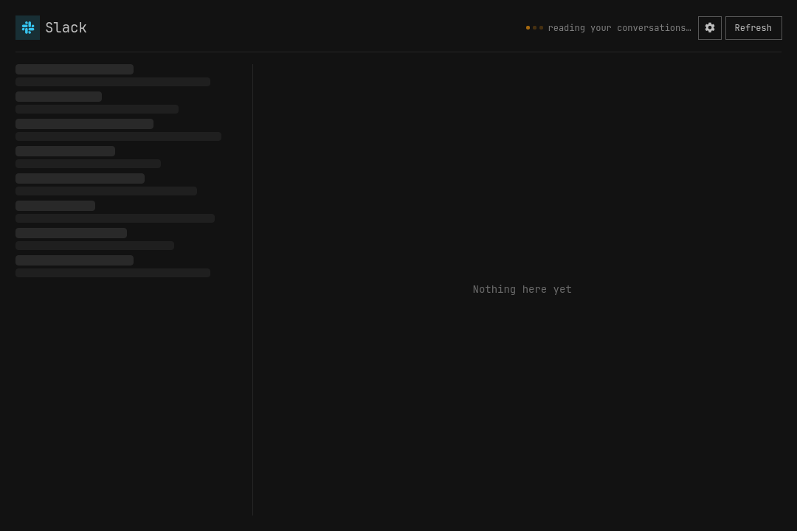
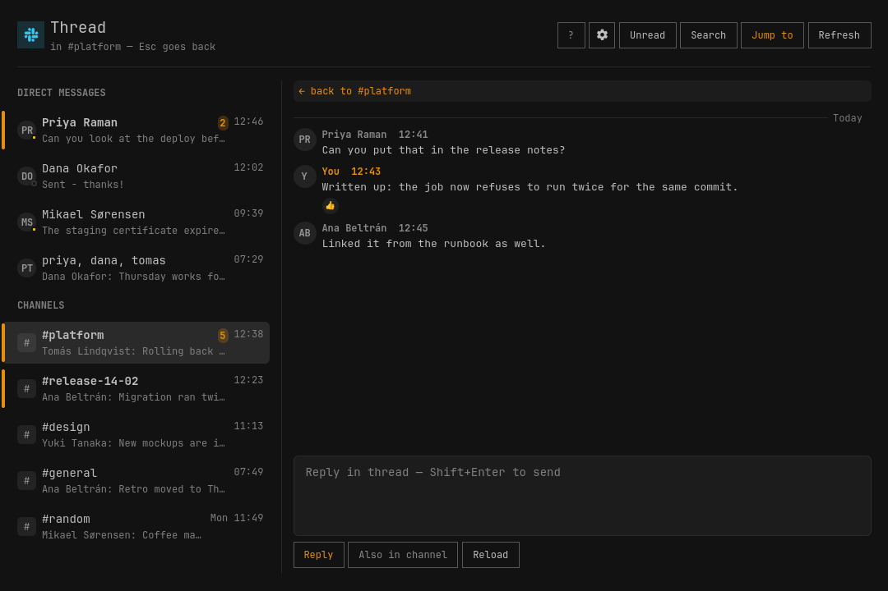
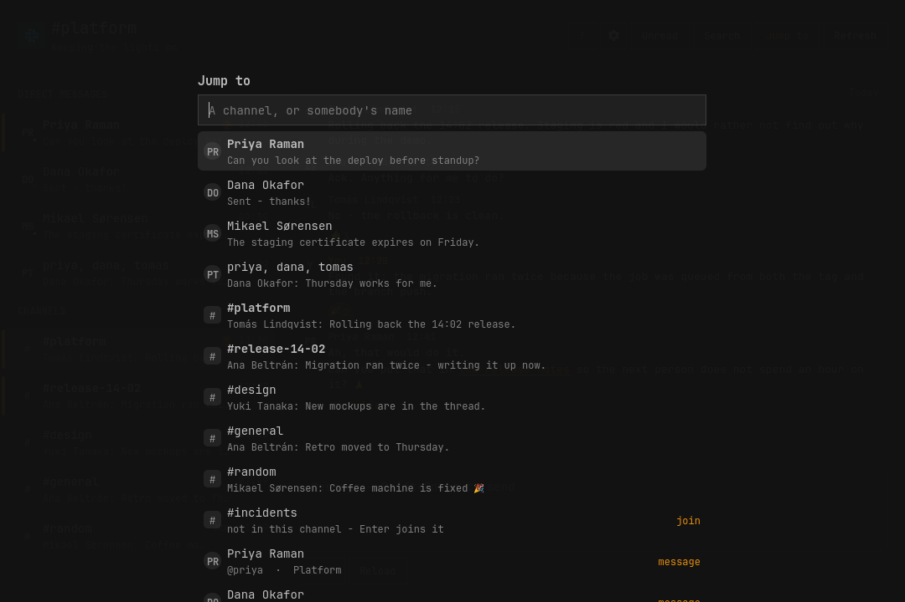

# Slack for Omarchy

Slack channels, direct messages and threads in the Omarchy bar, and in a window
of their own.

- **A bar icon** that tints when something is waiting, with a tooltip naming the
  workspace and the count. Optionally the number beside it.
- **A window** — a real Hyprland toplevel, tiled like anything else — with the
  conversations on the left, the transcript on the right, and a box to answer
  in.
- **Channels, group DMs and direct messages**, with unread marks, unread
  counts, previews and faces — all of it from one search per poll rather than
  one request per conversation, because Slack does not allow the latter (see
  below; it is the most interesting thing about this plugin).
- **Threads, and which of them have something new.** The part of Slack where
  half the conversation actually happens. A message with replies wears a chip
  saying how many — and the chip fills in and reads **`4 replies · new`** when
  that thread has something you have not read. Opening it is a view of its own,
  `Esc` comes back, and a reply can be sent to the channel as well.
- **Jump to anything** — `n`, or `Ctrl-k` from anywhere, including out of the
  message box. Your conversations first, then every channel in the workspace
  (Enter joins one you are not in), then every person (Enter opens a DM). This
  is how people who use Slack navigate Slack.
- **Search**, Slack's own, over every message you can see. A result opens the
  conversation *at that message* rather than at today's chatter.
- **Reactions**, counted, with yours marked — click a chip to add or remove
  yours. Keyboard first: `j`/`k` walk the transcript, `e` opens the picker on
  the message under the cursor, `1`–`9` pick.
- **A picture opens in the window**, whole rather than cropped to the thumbnail, with **Save as…** to keep a copy — a real save dialog, starting in your Downloads folder and suggesting a name from what the message called the picture. `s` saves, `o` hands it to whatever else views images, `Escape` closes.
- **Mentions, channel links, emoji, pictures and files**, all resolved:
  `<@U024BE7LH>` becomes a name, `:tada:` becomes 🎉, an image is drawn inline,
  anything else is a chip that opens where the file already lives.
- **Keyboard first.** The whole window drives from the keyboard — see below, or
  press `?` in the window.







Python 3 standard library only. It talks to the Slack Web API and nothing else.
No token ever reaches the QML: `src/slack.py` holds it, and the shell reads
JSON from it.

## Installing

```
omarchy plugin add https://github.com/janrenz/omarchy-slack.git --enable
omarchy bar set janrenz.omarchy.slack account work
```

Reload the shell and the icon is in the bar. Open the window, paste the token
from your own Slack app (below), and it fills in.

Nothing outside the plugin's own directory is written on install, and no
configuration of yours is overwritten — the settings live in the widget's own
entry in `~/.config/omarchy/shell.json`, alongside whatever else is in there.

A key of your own, if you want one, in `~/.config/hypr/bindings.lua`:

```lua
o.bind("SUPER + I", "Slack", "omarchy-shell shell toggle janrenz.omarchy.slack")
```

`omarchy menu keybindings --print` lists what is already taken; `hl.unbind("SUPER + I")`
before the line above frees a key that is.

## Removing

```
omarchy plugin remove janrenz.omarchy.slack
```

That takes the plugin off the disk. Three things of yours live outside it and
are deliberately left behind — delete them yourself if you want them gone:

| Path | What is in it |
|---|---|
| `~/.config/omarchy/shell.json` | Your settings, in the widget's entry. |
| `~/.local/state/omarchy/slack/` | The token. Delete this to sign out. |
| `~/.cache/omarchy/slack/` | Names, channel lists, read marks, previews, the last snapshot, and pictures already fetched. |

The Slack app is yours and is untouched either way; delete it at
[api.slack.com/apps](https://api.slack.com/apps) if you are done with it.

## You need a Slack app of your own

This is the one part nobody can do for you.

Slack has no device-code flow, and it will not redirect a browser back to a
desktop that has no `https` address to be sent to — so there is no sign-in this
plugin could host. What Slack does offer, and what every personal integration
uses, is an app you install into your own workspace and a token it shows you.

1. Go to **[api.slack.com/apps](https://api.slack.com/apps) → Create New App →
   From an app manifest**, pick your workspace, and paste this:

   ```yaml
   display_information:
     name: Omarchy Slack
     description: Slack in the Omarchy bar
   oauth_config:
     scopes:
       user:
         - channels:history
         - channels:read
         - channels:write
         - groups:history
         - groups:read
         - groups:write
         - im:history
         - im:read
         - im:write
         - mpim:history
         - mpim:read
         - mpim:write
         - chat:write
         - reactions:read
         - reactions:write
         - users:read
         - files:read
         - files:write
         - search:read
   settings:
     org_deploy_enabled: false
     socket_mode_enabled: false
     token_rotation_enabled: false
   ```

   If that button does nothing — a blocked script, a workspace that hides it,
   a browser that will not open the modal — there is a second way in, and it
   uses the App Configuration Token from the bottom of the *Your Apps* page
   (the one everybody copies by mistake instead of the User OAuth Token):

   ```
   read -rs TOKEN && printf '{"token":"%s"}' "$TOKEN" | python3 src/slack.py create-app
   ```

   It builds the manifest from the same scope list the code checks against, has
   Slack validate it, creates the app, and prints the page to press **Install**
   on. `--dry-run` stops after the validation and creates nothing.

2. **Install to Workspace**, and approve it. Some workspaces need an
   administrator to approve an app; if yours does, this is where it will say so.
3. **OAuth & Permissions → User OAuth Token**, the one starting `xoxp-`. Copy it.
4. In the Slack window, paste it into the box and press **Sign in**.

They are all *user* scopes, not bot scopes: this plugin reads what you can read
and posts as you, which is the point. Nothing here lets the app act on its own,
and there is no bot in your workspace afterwards.

### Four things on that site are called a token. Only one of them is this one

`auth.test` accepts every one of them and answers with your name and your
workspace, so "the token worked" is not the same question as "this is the right
token". The plugin asks the second one — it reads the scopes off the response
and refuses the rest, by name, before storing anything.

| What you might have copied | Where it is | What it is |
|---|---|---|
| **User OAuth Token**, `xoxp-…` | your app → OAuth & Permissions, after installing | **the one this wants** |
| Bot User OAuth Token, `xoxb-…` | the same page, above it | acts as a bot, cannot read your DMs |
| App Configuration Token, `xoxe.xoxp-…` (+ a refresh token) | the bottom of the **Your Apps** list page | edits app manifests, and nothing else |
| A rotating user token, `xoxe.xoxp-…` | your app, with token rotation on | expires in twelve hours; this plugin cannot refresh it, so turn rotation off |

The last two look identical and are the easy mistake: the pair at the bottom of
the *Your Apps* page belongs to Slack's app-management API, not to your
workspace.

### What each scope buys, and what happens without it

Every one of these is optional except the first two. What the token was
actually granted is read back off the API — every Slack response carries an
`x-oauth-scopes` header — so the window offers what will work and says which
scope would enable the rest, rather than showing a button that fails.

| Scope | For | Without it |
|---|---|---|
| `channels:read`, `groups:read`, `im:read`, `mpim:read` | listing your conversations | nothing to show |
| `channels:history`, `groups:history`, `im:history`, `mpim:history` | reading them | no previews, no transcript |
| `chat:write` | answering | the message box is disabled |
| `channels:write`, `groups:write`, `im:write`, `mpim:write` | marking read as you open, opening a DM, joining a channel | unread marks only clear in this window, and the switcher can only reach what you are already in |
| `reactions:read`, `reactions:write` | reactions, and yours | the chips are gone |
| `users:read` | names, faces, and who is around | ids where names would be |
| `files:read` | pictures in the transcript | files are chips only |
| `files:write` | sending a file | no **Attach** button, and dropping a file on the window does nothing |
| `search:read` | searching every message — **and every preview and unread mark in the sidebar**, see below | the sidebar is names only |

Adding a scope later means editing the app, reinstalling it, and pasting the
new token. The plugin notices the moment it has it. That includes `files:write`,
which an app installed before this plugin could send files will not have.

## Sending a file

**Attach** beside Send opens a file chooser, and dropping a file anywhere on the
window does the same thing — anywhere rather than on the transcript, because
aiming at a scrolling list is a worse target than a window, and there is only
ever one conversation open to mean. Whatever is in the message box goes with the
file as its comment, which is what Slack itself does.

One file at a time. Slack takes several, but each one is three requests against
a rate limit, and a folder of forty dropped by accident is not something to find
out about halfway through. The cap is 25 MB — Slack's own is a thousand times
that, but the file is read into memory to be sent, and a shell should not hold a
gigabyte to pass it along.

The upload is three steps and only the last one shares anything: Slack reserves
an id and a URL, the bytes go to that URL, and a third call puts the file in the
conversation. If that third call fails the file exists and nobody can see it,
and the plugin says exactly that rather than calling it a failure.

## Keyboard

Press `?` in the window for this same list. Omarchy is keyboard-first, so the
window is a focus ladder rather than a bag of shortcuts: **list → conversation
→ message box**. `h` and `l` step between the rungs, `Escape` walks back out
one rung at a time, and `j`/`k` always mean "down and up in whatever has
focus".

### Moving

| Key | What it does |
|---|---|
| `j` / `k`, `↓` / `↑` | Down and up in whatever has focus — the conversations, or the messages in the open one |
| `Enter` | Open the conversation under the cursor, and move focus into it |
| `h` / `←` | Back to the list, **leaving the conversation open**. Narrow windows slide the list out over it |
| `l` / `→` | Into the conversation; again into the message box |
| `Tab` or `i` | Straight to the message box |
| `Escape` | Back one step: picker → message box → thread → conversation → list → close the conversation → close the window |

### Scrolling

| Key | What it does |
|---|---|
| `Page Up` / `Page Down` | A screenful of whatever has focus |
| `Ctrl-u` / `Ctrl-d` | Half a screen |
| `Ctrl-b` / `Ctrl-f` | A screen |
| `g` / `G` | To the top / to the newest |
| `Home` / `End` | The same as `g` / `G` |

### Doing

| Key | What it does |
|---|---|
| `t` | Open the thread on the message under the cursor |
| `a` | Hand this conversation to your coding agent — see below |
| `e` or `+` | React to that message. Again, or `Escape`, closes the picker |
| `1` – `9` | Pick that reaction. The one you already gave takes it back |
| `s` / `o` | In a picture: save a copy / open it elsewhere |
| `Shift+Enter` or `Ctrl+Enter` | Send. Plain `Enter` is a newline |
| `n`, or `Ctrl-k` | Jump to any channel or person — `Ctrl-k` works from inside the message box too |
| `/` | Search every message |
| `f` | Filter the conversations already listed |
| `u` | Show only what is unread |
| `m` | Mark this conversation read |
| `r` | Reload this conversation |
| `,` | Settings |
| `?` | This list |

## Settings

Open the window and press the gear, or `,`. The form writes into the widget's
entry in `~/.config/omarchy/shell.json`; `omarchy bar set janrenz.omarchy.slack
<key> <value>` does the same thing from a terminal.

Nothing in the shell renders a settings form for a third-party bar widget — a
manifest schema is declared, but the only reference to it anywhere in the shell
is the line that writes it into the registry — so the plugin brings its own.

| Key | Default | What it does |
|---|---|---|
| `account` | — | **Required.** A short name for this sign-in. It names the token file, not the Slack workspace. |
| `conversations` | `40` | How many conversations may be asked how much of them you have read, per poll (5–120). The previews cost one search for the whole workspace, so this is only about the unread marks. |
| `sort` | `recent` | `recent` puts whatever spoke last at the top of each section; `name` is alphabetical. |
| `density` | `cosy` | How much room the window gives things: `compact`, `cosy`, `roomy`, `spacious`. A multiplier over the theme's own spacing, so it follows your font size. |
| `avatars` | `true` | Faces, fetched by the helper and cached on disk. |
| `presence` | `true` | A dot on each DM saying whether they are around. One request per person in view. |
| `refreshIntervalSec` | `120` | How often to poll (30–3600). |
| `pausePolling` | `true` | Stop polling while the screen has been idle five minutes or there is no network. Doubles the interval on battery. |
| `icon` / `label` | `󰓭` | Bar glyph, or text instead of it. |
| `tintOnUnread` | `true` | Highlight the bar icon while something is unread. |
| `showCount` | `false` | The number of waiting conversations, beside the icon. |
| `notify` | `true` | Desktop notification when a conversation has something new in it. |
| `agentHandover` | `true` | Whether `a` and the **Ask agent** button are there at all, and whether a draft from an agent is accepted. |

## Notifications

A conversation with something new in it raises a desktop notification: its
name, and a line of what was said. More than three arriving in one poll become
a single summary instead of a stack.

What counts as new is *new since the shell started watching*, not *unread*. The
first answer after a sign-in — or after a laptop wakes up to a morning of
messages — is an entire backlog at once, and announcing all of it is what makes
people turn notifications off for good. So the first poll of a workspace primes
quietly and only what turns up after it is announced. Nothing you sent yourself
is announced either.

They are raised from behind the bar icon, not from the window, so they arrive
whether or not the window is open — and only once, though both have a service
of their own polling the same workspace.

Clicking the notification opens that conversation on that message. Several
messages in one conversation update one notification rather than stacking three,
and the click still works after the shell has been restarted underneath it — the
action travels as data on the notification rather than as a callback into the
process that sent it.

## When it does not poll

Slack's rate limits are the design constraint everywhere else in this plugin,
and they are the reason for this too: a poll costs a search whether or not
anybody is at the machine. Nothing is asked of Slack while the screen has been
idle for five minutes, or while the machine has no network at all, and a fetch
goes out the moment you come back or reconnect rather than at the next tick.
Idle inhibitors count as being present, so a full-screen call does not look like
an empty desk. On battery the interval is doubled, and tripled in the
power-saver profile.

Anything you ask for by hand still goes out, offline included: a failure you can
see beats a silence you cannot. The bar's tooltip says why nothing is moving
while it is paused. Set `pausePolling` to `false` to keep the old fixed cadence.

## Your coding agent

Omarchy already knows which coding agent you use — `omarchy default agent`
picks one, `omarchy-agent` launches it. Press `a` in a conversation, or the
**Ask agent** button beside the message box, and that agent opens on the
conversation you are reading.

What crosses over is a pointer, not a transcript. The prompt names the
workspace alias, the conversation id, the open thread and the message the
cursor was on, and points at a skill in `skills/omarchy-slack/`; the agent then
reads the conversation through `src/slack.py`, the same helper the window uses.
Two reasons for that. Anyone on this machine can read another process's command
line, and an agent window lives for hours — so other people's messages have no
business being in it. And the agent reads what is in the conversation *now*,
not what happened to be on screen when you pressed the key.

The skill tells it to draft rather than to post. An answer it writes comes back
into the message box, focused and unsent:

```bash
omarchy-shell shell summon janrenz.omarchy.slack \
  '{"draft":{"channel":"C0123","text":"Ich schaue morgen früh drauf."}}'
```

The window opens if it was closed. Sending stays a keypress you make — nothing
an agent does here reaches Slack.

`src/handover.sh` is what the key runs, and it is usable on its own: `--print`
shows the prompt instead of launching anything, which is also how you would
point a Hyprland binding at a particular channel.

Turn the whole thing off with `agentHandover` in the settings and the key, the
button and the help entry are gone, and a draft arriving from an agent is
refused rather than quietly applied.

## Which threads are unread

A message with replies wears a chip. When the thread has something in it you
have not read, the chip fills in and says so:

```
4 replies · new  ›          a thread you follow, with something new in it
4 replies  ›                everything in it has been read
```

Slack answers this question, but only in one particular way, and the chip is
shaped by what it actually answers:

- **Only threads you follow.** A thread parent comes back with
  `subscribed: true` when you replied to it or pressed Follow, and only then
  does Slack send `last_read` for it. An unfollowed thread is not unread in
  Slack's own reckoning either, so the chip claims nothing about it.
- **The fact, never a number.** The payload carries `last_read` and
  `latest_reply` and no unread count anywhere, so the chip says `new` rather
  than inventing `2 new`.
- **The channel you have open, not the sidebar.** The marks ride along in the
  `conversations.history` response the transcript already fetches, so they cost
  nothing extra. Marks for every channel at once would need one history request
  per channel per poll, and Slack allows an app outside its Marketplace about
  one a minute — the same wall the whole design is built around.
- **Reading a thread here clears its chip.** Slack has no method for a thread's
  read mark: `conversations.mark` is the channel's mark and there is nothing
  else. So what you read here is remembered on this machine, in
  `~/.cache/omarchy/slack/<workspace>/threads.json`, and that file is only ever
  allowed to *take a mark off* — nothing local can make a thread look unread
  that Slack says is read. Read the thread in a real Slack client and the mark
  goes away on its own.

## How it knows what is new, and why it is built the way it is

Worth explaining, because one Slack limit decides the shape of the whole
plugin.

**Slack allows an app that is not in its Marketplace one `conversations.history`
request per minute.** Every app anybody makes for themselves is such an app.
Measured on a real workspace: after a minute of quiet, six calls five seconds
apart came back one success and five refusals. There is a small burst
allowance — about fifteen — and then it stops.

So the obvious design, the one the Teams plugin uses and the one this plugin
was first built with, is impossible here: a sidebar cannot ask each
conversation what was said in it last. Forty conversations would need forty
requests, and forty requests would need forty minutes.

What is *not* limited is search. One `search.messages` for everything since a
date, newest first, returns the last few hundred messages across every
conversation you are in — each with its channel, its author, its text and its
timestamp. That is what forty history requests would have said, in one request,
and it covers the whole workspace rather than the forty that fitted in a
budget.

So a poll is:

1. two requests listing your channels and your direct messages, by name;
2. one search — three at most — for everything said in the last fortnight,
   which is where every preview and every "this is new" comes from;
3. `conversations.info` for the conversations whose newest message is newer
   than the read mark already held, which says how much of it you have read.
   That endpoint is not restricted; measured at ten calls a second without a
   refusal.

Three more things are not asked again once they have been answered:

- **the conversation list**, for fifteen minutes — which channels you are in
  changes about weekly, and joining one from here refreshes it on the spot;
- **who is around**, for a minute, and never on the critical path: presence is
  one request per person, so it is a command of its own that the window calls
  once the sidebar is already on screen;
- **the finished snapshot**, so a shell that has just started draws the sidebar
  it had rather than a blank one, and so the two services — one behind the bar
  icon, one behind the window — are not two pollers. The one that raises
  notifications does the work; the other reads what it wrote, so an open window
  costs no requests at all.

A full poll of a workspace with 42 channels and 403 direct messages takes about
three and a half seconds and never touches the limit; the sidebar itself is on
screen in about a fifth of a second, from the last snapshot. `conversations.history` is spent on
exactly one thing: the conversation you open. A few in a row is fine; opening
fifteen in a minute is not, and the window says so in those words rather than
showing an empty transcript.

Two consequences worth knowing:

- **A conversation quieter than the search window has no preview.** It is
  listed, it opens, it just has nothing recent to show — so the row shows the
  channel's topic instead. Whatever was seen in an earlier poll is remembered
  on disk and keeps showing.
- **An unread count is counted out of that same search**, so a conversation
  with more waiting than the window holds is counted low rather than high.

Opening a conversation marks it read, in Slack itself, so the count clears in
every client you own — up to the newest message the search found, which
includes replies inside a thread. The transcript is the channel timeline and a
thread reply is not in it, so marking read up to the last line on screen would
leave those rows lit with nothing left to read in them; the read mark goes to
whichever is newer. When a row does stay unread anyway — the search window
missed it, or the poll ran while the window was shut — **Mark read** in the
header (or `m`) clears it. The mark only ever moves forward, so nothing you
have already read comes back.

## What it does not do

- **No live updates.** It polls on the interval above. Live Slack means a
  websocket held open for the session, and a desktop shell has no business
  running one.
- **Opening conversations quickly runs into Slack's own wall.** One history
  request a minute, plus a burst of about fifteen, for any app outside the
  Marketplace. Reading is unaffected once a conversation is open; it is opening
  the sixteenth in a minute that waits.
- **Nothing quieter than a fortnight gets a preview** unless it was seen in an
  earlier poll, for the same reason.
- **A thread reply does not bump its channel.** Slack counts threads apart from
  channels, and so does this: `conversations.history` does not return a reply
  unless the sender ticked "also send to channel". So the sidebar's unread mark
  is about the channel, and the thread chips inside it are about the threads —
  see below for why there can be no sidebar mark for a thread.
- **One workspace per install.** The window is one per plugin, and the widget
  is `allowMultiple: false`. Two workspaces would be two sidebars fighting over
  one window.
- **Muted channels are not muted.** Slack keeps mutes in a preference the Web
  API does not publish, so a muted channel is an ordinary channel here.
- **No huddles, calls, canvases, workflows, or editing what you sent.**
- **A workspace's own emoji stay as their names.** `:blob-wave:` is a picture
  that lives in that workspace and there is no character for it, so the name is
  what a reader gets — which is what a terminal client would show and is at
  least honest about what was sent.
- **A message never chooses its own markup.** Slack messages are mrkdwn, not
  HTML, and nothing here renders markup: `slack.py` flattens a message into
  text, and the only tag the window ever builds is an `<a>` around text it
  escaped first. A link keeps its address, but as an offset into that text
  rather than as a tag — so what reaches the window is still only words, and
  the window still builds every tag it draws. Only `http`, `https` and `mailto`
  become links, checked in `slack.py`, again in `Model.js` where the anchor is
  written, and once more in `openUrl` before `xdg-open` sees it.
- **Pictures are fetched by the helper, never by the window.** They are checked
  against a list of Slack's own hosts before anything is fetched, and the token
  is attached for `files.slack.com` alone — an avatar CDN does not need it and
  does not get it. An `` in a message can neither
  collect a token nor tell anybody when a message was read.
- **The token is never in `shell.json`.** That file holds the bar layout and is
  world-readable. The token goes to the helper over stdin — anyone on this
  machine can read another process's arguments, and nobody can read its stdin —
  and lives in `~/.local/state/omarchy/slack/`, mode 600.

## Development

```
python3 dev/test-slack.py                                # the helper: parsing, permission, hosts
node dev/test-model.js                                   # the shaping the window binds to
python3 src/slack.py fetch --account work --demo         # synthetic data, no sign-in
python3 src/slack.py create-app --dry-run                # is the manifest still acceptable?

dev/run.sh                                               # the real window, offscreen, on fixtures
dev/shot.sh /tmp/slack.png                               # photograph what it is drawing
dev/showcase.sh                                          # regenerate the images in this README
```

`--demo` works through the whole plugin, so the layout can be built without a
workspace. Every read is answered from the fixtures in `src/slack.py`, and
every write — sending, reacting, marking read, joining — returns as if it had
happened and posts nothing.

`dev/run.sh` starts a Quickshell of its own with `QT_QPA_PLATFORM=offscreen`
and loads `SlackWindow.qml` itself — the same window the shell hosts, the same
service under it — then draws its own screenshots through `grabToImage`. Your
bar, your `shell.json` and your session are not involved, which is the
difference from the Teams plugin's showcase script: that one installs a demo
widget into your live shell and puts your configuration back afterwards.

```
qs -p $XDG_RUNTIME_DIR/omarchy-slack-dev/shell.qml ipc call dev state
qs -p $XDG_RUNTIME_DIR/omarchy-slack-dev/shell.qml ipc call dev open demo-im-0
qs -p $XDG_RUNTIME_DIR/omarchy-slack-dev/shell.qml ipc call dev pane switcher
qs -p $XDG_RUNTIME_DIR/omarchy-slack-dev/shell.qml ipc call dev spacing roomy
```

Two settings exist for the harness's benefit, both ignored unless `demo` is on:

| Key | Does |
|---|---|
| `demo` | Answer every read from the fixtures, and refuse every write. |
| `demoOpen` | The id of a conversation to open by itself once the list loads, e.g. `demo-channel-0`. |

## License

MIT — see [LICENSE](LICENSE). The only dependency is Python 3 from the standard
library; nothing is vendored and nothing is installed with pip.
