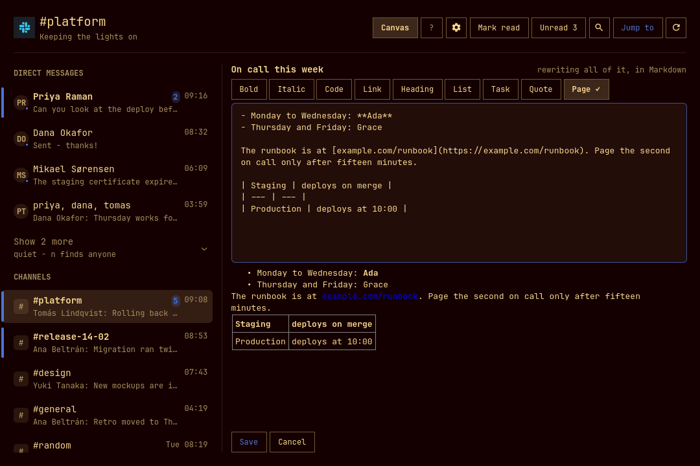

# Slack for Omarchy

Slack channels, direct messages and threads in the Omarchy bar, and in a window
of their own.

- **A bar icon** that tints when something is waiting, with a tooltip naming the
  workspace and the count. Optionally the number beside it.
- **A dropdown behind it**, and deliberately only one thing: what is waiting.
  That is the question a bar is asked — *does anything need me* — and it is
  answered by picking from a short list, which is what a popup that closes on
  click-away can do. Reading a conversation and writing a reply is not, so a row
  here opens the window at that conversation rather than being a smaller copy of
  it. Right-click the icon to skip the dropdown and go straight to the window.
- **A window** — a real Hyprland toplevel, tiled like anything else — with the
  conversations on the left, the transcript on the right, and a box to answer
  in.
- **Channels, group DMs and direct messages**, with unread marks, unread
  counts, previews and faces — all of it from one search per poll rather than
  one request per conversation, because Slack does not allow the latter (see
  below; it is the most interesting thing about this plugin). The direct
  messages nothing has been said in lately carry no date, and fold behind a
  **Show 4 more** row rather than burying the four people who wrote this week —
  anything unread stays out in the open regardless, filtering or the unread
  toggle unfolds it, and `n` reaches every DM by name whether it is folded or
  not.
- **Threads, and which of them have something new.** The part of Slack where
  half the conversation actually happens. A message with replies wears a chip
  saying how many — and the chip fills in and reads **`4 replies · new`** when
  that thread has something you have not read. Opening it is a view of its own,
  `Esc` comes back, and a reply can be sent to the channel as well.
- **Jump to anything** — `n`, or `Ctrl-k` from anywhere, including out of the
  message box. Your conversations first, then every channel in the workspace
  (Enter joins one you are not in), then every person (Enter opens a DM). This
  is how people who use Slack navigate Slack.
- **Search**, Slack's own, over every message you can see. A result opens the
  conversation *at that message* rather than at today's chatter.
- **Reactions**, counted, with yours marked — click a chip to add or remove
  yours. The pointer on a chip says who reacted, what the emoji is called, and
  which of the two a click would do. Keyboard first: `j`/`k` walk the
  transcript, `e` opens the picker on the message under the cursor, `1`–`9`
  pick.
- **A picture opens in the window**, whole rather than cropped to the thumbnail, with **Save as…** to keep a copy — a real save dialog, starting in your Downloads folder and suggesting a name from what the message called the picture. `s` saves, `o` hands it to whatever else views images, `Escape` closes.
- **Mentions, channel links, emoji, pictures and files**, all resolved:
  `<@U024BE7LH>` becomes a name, `:tada:` becomes 🎉, an image is drawn inline,
  anything else is a chip that opens where the file already lives.
- **The channel's canvas, read and written.** The charter, the runbook, who is
  on call — `c` opens it in the transcript's own space, with no message box
  under it, because a document is not a conversation. `e` writes in it: the
  canvas as Markdown, the page it will make beside what you type, and buttons
  for the markers. **Add to the end** is the way in that never touches what is
  already there, and a canvas this window could not rewrite faithfully is only
  offered that one.
- **Keyboard first.** The whole window drives from the keyboard — see below, or
  press `?` in the window.




Python 3 standard library only. It talks to the Slack Web API and nothing else.
No token ever reaches the QML: `src/slack.py` holds it, and the shell reads
JSON from it.

## Installing

```
omarchy plugin add https://github.com/janrenz/omarchy-slack.git --enable
omarchy bar set janrenz.omarchy.slack account work
```

Reload the shell and the icon is in the bar. Open the window, press **Sign in
with Slack**, and pick your workspace in the browser. Nothing to paste and no
Slack app of your own to create.

Nothing outside the plugin's own directory is written on install, and no
configuration of yours is overwritten — the settings live in the widget's own
entry in `~/.config/omarchy/shell.json`, alongside whatever else is in there.

A key of your own, if you want one, in `~/.config/hypr/bindings.lua`:

```lua
o.bind("SUPER + I", "Slack", "omarchy-shell shell toggle janrenz.omarchy.slack")
```

`omarchy menu keybindings --print` lists what is already taken; `hl.unbind("SUPER + I")`
before the line above frees a key that is.

## Removing

```
omarchy plugin remove janrenz.omarchy.slack
```

That takes the plugin off the disk. Three things of yours live outside it and
are deliberately left behind — delete them yourself if you want them gone:

| Path | What is in it |
|---|---|
| `~/.config/omarchy/shell.json` | Your settings, in the widget's entry. |
| `~/.local/state/omarchy/slack/` | The token. Delete this to sign out. |
| `~/.cache/omarchy/slack/` | Names, channel lists, read marks, previews, the last snapshot, and pictures already fetched. |

The Slack app is yours and is untouched either way; delete it at
[api.slack.com/apps](https://api.slack.com/apps) if you are done with it.

## Signing in

Press **Sign in with Slack**, in the window or in settings. Your browser opens
Slack's own permission page, you pick the workspace and press Allow, and Slack
sends you back to this machine signed in. Nothing is pasted and no app of your
own is needed.

That was not possible for most of this plugin's life, and the README used to
say so: Slack had no device-code flow and would not redirect a browser to a
desktop with no `https` address to be sent to. Slack made **PKCE** generally
available on 2026-03-30 and that stopped being true. A public client — one with
no secret to keep, which a plugin shipped as source is — proves it started the
sign-in it is finishing by holding a random secret back until the end: the
browser carries a SHA-256 of it, the token exchange carries the secret itself,
and an authorization code stolen in between is worth nothing without it.

Three details of that flow are worth knowing, because they are what makes it
safe to ship:

- **There is no client secret.** `oauth.v2.access` takes none for a public
  client — not an empty one, none. The client id in the source is an
  identifier, the way a username is.
- **The browser comes back over `omarchy-slack://`**, which the desktop hands
  to a small handler that carries the callback to the waiting sign-in over a
  socket in your runtime directory — a directory only you can read. It checks
  the `state` it started with before it looks at anything else, so a link from
  somewhere else cannot finish somebody's sign-in for them. Setting the
  handler up happens as part of signing in; there is nothing to run first.
  See [The `omarchy-slack://` handler](#the-omarchy-slack-handler).
- **A desktop sign-in may not ask for bot scopes**, which suits a plugin that
  has never wanted one. It reads what you can read and posts as you.

The token from this flow lasts twelve hours and is renewed from a refresh
token that rotates with it. That happens on its own, before a poll that would
otherwise fail; there is nothing to do about it and nothing to re-paste. Slack
retires each refresh token as it is spent, so the renewal is taken under a
lock — several copies of this plugin run at once, one behind the window and
one behind the bar on each monitor, and two of them spending the same refresh
token would sign the account out with no way back.

**A refresh token from a PKCE sign-in expires after 30 days**, where one from
the old pasted-token route did not expire at all. In practice a machine you
use keeps renewing long before that; a machine you come back to after a month
away asks you to sign in again, and says so rather than failing quietly.

### The `omarchy-slack://` handler

**This is the only way the browser comes back**, and it is set up as part of
the first sign-in — one desktop entry under `~/.local/share/applications/` and
an `xdg-mime` default, for your user alone. Nothing needs root and nothing
outside your home directory is touched. To do it by hand, or to check:

```bash
python3 ~/.config/omarchy/plugins/janrenz.omarchy.slack/src/slack.py scheme-status
python3 ~/.config/omarchy/plugins/janrenz.omarchy.slack/src/slack.py scheme-register
```

`scheme-forget` hands the scheme back.

**Why there is no `http://localhost` fallback any more.** There was one, and it
was removed rather than kept. An `http://` redirect URL is what a Slack
Marketplace submission is refused over, and the listing is not a vanity item:
the rate limits this entire plugin is shaped around — one
`conversations.history` a minute — are the ones a *non*-Marketplace app gets.
So an app that cannot be submitted is an app that stays slow for ever, and the
localhost redirect was the thing standing between the two.

There is no `https` answer to reach for either. No public certificate authority
will issue for `localhost`, a certificate shipped inside an open-source plugin
publishes its own private key, and bouncing the callback through a host of ours
would put a third party in the middle of every sign-in. A custom scheme is not
`http` at all, so the rule has nothing to object to — and under Slack's PKCE
rules it is *always* a desktop redirect, where `localhost` is one only because
the app opted into PKCE. It has no port either, which retires the three
registered ports the old route needed, since Slack matches a redirect URL
exactly including the port.

**Where it cannot work, paste a token instead.** A machine with no
`XDG_RUNTIME_DIR`, or a browser in a sandbox that cannot see a handler on the
host, can no longer use the browser sign-in at all. That is what
[Or paste a token](#or-paste-a-token) is for, and it is the reason that route
is still here.

### Or an app of your own

A workspace that would rather be its own app — for its admins' own audit
trail, or because it does not allow this one — puts that app's **client id**
into the plugin's settings, and the browser sign-in above uses it instead.
The client id is on the app's Basic Information page. Two settings have to be
made on that app, **in this order**:

1. **Settings → OAuth & Permissions → Advanced token security via PKCE**, on.
   Slack makes this a one-way switch.
2. **`omarchy-slack://auth`** added to the Redirect URLs on the same page.

The order is not a preference. Slack refuses a custom URI scheme from an app
that is not yet a PKCE public client, and it refuses it in that field with the
generic **"A valid URL must be entered"**, which says nothing about PKCE. With
the switch on first, the field takes it.

### Or paste a token

The old way still works, and is still the way in for a workspace where the
browser flow is refused outright.

1. Go to **[api.slack.com/apps](https://api.slack.com/apps) → Create New App →
   From an app manifest**, pick your workspace, and paste this:

   ```yaml
   display_information:
     name: Omarchy Slack
     description: Slack in the Omarchy bar
   oauth_config:
     scopes:
       user:
         - channels:history
         - channels:read
         - channels:write
         - groups:history
         - groups:read
         - groups:write
         - im:history
         - im:read
         - im:write
         - mpim:history
         - mpim:read
         - mpim:write
         - chat:write
         - reactions:read
         - reactions:write
         - users:read
         - files:read
         - files:write
         - search:read
         - stars:read
         - canvases:write
   settings:
     org_deploy_enabled: false
     socket_mode_enabled: false
     token_rotation_enabled: false
   ```

   If that button does nothing — a blocked script, a workspace that hides it,
   a browser that will not open the modal — there is a second way in, and it
   uses the App Configuration Token from the bottom of the *Your Apps* page
   (the one everybody copies by mistake instead of the User OAuth Token):

   ```
   read -rs TOKEN && printf '{"token":"%s"}' "$TOKEN" | python3 src/slack.py create-app
   ```

   It builds the manifest from the same scope list the code checks against, has
   Slack validate it, creates the app, and prints the page to press **Install**
   on. `--dry-run` stops after the validation and creates nothing.

2. **Install to Workspace**, and approve it. Some workspaces need an
   administrator to approve an app; if yours does, this is where it will say so.
3. **OAuth & Permissions → User OAuth Token**, the one starting `xoxp-`. Copy it.
4. In the Slack window, paste it into the box and press **Sign in**.

They are all *user* scopes, not bot scopes: this plugin reads what you can read
and posts as you, which is the point. Nothing here lets the app act on its own,
and nobody can send anything through it but you.

### The name you give the app is a name other people see

Slack stamps every message posted through an app with that app's identity, even
when the token is your own user token and the message is from you. In the
conversation the message is yours and looks it. In the sidebar's one-line
preview of the newest message, and anywhere else Slack summarises rather than
renders, the label is the app's name — so a channel's preview line reads
`Omarchy Slack: see you at four` to everybody in it.

There is no way to post without it. `chat.postMessage` has no parameter that
detaches a message from the app it was sent through; `as_user: true` changes
nothing, because for a user token it is already true. What the name *is*, on
the other hand, is entirely yours: put your own name in `display_information`
above, or anything else you would not mind reading in that line. It can be
changed later — **api.slack.com/apps → your app → Basic Information → Display
Information → App Name** — and changing only the name does not touch the
scopes, so the token you already pasted goes on working.

### Four things on that site are called a token. Only one of them is this one

`auth.test` accepts every one of them and answers with your name and your
workspace, so "the token worked" is not the same question as "this is the right
token". The plugin asks the second one — it reads the scopes off the response
and refuses the rest, by name, before storing anything.

| What you might have copied | Where it is | What it is |
|---|---|---|
| **User OAuth Token**, `xoxp-…` | your app → OAuth & Permissions, after installing | **the one this wants** |
| Bot User OAuth Token, `xoxb-…` | the same page, above it | acts as a bot, cannot read your DMs |
| App Configuration Token, `xoxe.xoxp-…` (+ a refresh token) | the bottom of the **Your Apps** list page | edits app manifests, and nothing else |
| A rotating user token, `xoxe.xoxp-…` | your app, with token rotation on | expires in twelve hours; this plugin cannot refresh it, so turn rotation off |

The last two look identical and are the easy mistake: the pair at the bottom of
the *Your Apps* page belongs to Slack's app-management API, not to your
workspace.

### What each scope buys, and what happens without it

Every one of these is optional except the first two. What the token was
actually granted is read back off the API — every Slack response carries an
`x-oauth-scopes` header — so the window offers what will work and says which
scope would enable the rest, rather than showing a button that fails.

| Scope | For | Without it |
|---|---|---|
| `channels:read`, `groups:read`, `im:read`, `mpim:read` | listing your conversations | nothing to show |
| `channels:history`, `groups:history`, `im:history`, `mpim:history` | reading them | no previews, no transcript |
| `chat:write` | answering | the message box is disabled |
| `channels:write`, `groups:write`, `im:write`, `mpim:write` | marking read as you open, opening a DM, joining a channel | unread marks only clear in this window, and the switcher can only reach what you are already in |
| `reactions:read`, `reactions:write` | reactions, and yours | the chips are gone |
| `users:read` | names, faces, and who is around | ids where names would be |
| `files:read` | pictures in the transcript | files are chips only |
| `files:write` | sending a file | no **Attach** button, and a file dropped on the window is turned away with a line saying this scope is why |
| `search:read` | searching every message — **and every preview and unread mark in the sidebar**, see below | the sidebar is names only |
| `stars:read` | which conversations you starred in Slack, so your favourites lead each section of the sidebar | the sidebar orders by recency or name alone |
| `canvases:write` | writing in a channel's canvas | the canvas can be read here and not written, and the pane says so |

Adding a scope later means editing the app, reinstalling it, and pasting the
new token. The plugin notices the moment it has it. That includes `files:write`,
which an app installed before this plugin could send files will not have,
`stars:read`, which one installed before it respected your favourites will not,
and `canvases:write`, which one installed before it could write in a canvas
will not.

## Sending a file

**Attach** beside Send opens a file chooser, and dropping a file anywhere on the
window does the same thing — anywhere rather than on the transcript, because
aiming at a scrolling list is a worse target than a window, and there is only
ever one conversation open to mean. Whatever is in the message box goes with the
file as its comment, which is what Slack itself does.

A drop that will not go through says so while the file is still in the air:
the window outlines itself and names what is in the way — no conversation open,
a file already going up, or a token without `files:write`, which is the usual
reason a drop looks like it did nothing at all.

One file at a time. Slack takes several, but each one is three requests against
a rate limit, and a folder of forty dropped by accident is not something to find
out about halfway through. The cap is 25 MB — Slack's own is a thousand times
that, but the file is read into memory to be sent, and a shell should not hold a
gigabyte to pass it along.

The upload is three steps and only the last one shares anything: Slack reserves
an id and a URL, the bytes go to that URL, and a third call puts the file in the
conversation. If that third call fails the file exists and nobody can see it,
and the plugin says exactly that rather than calling it a failure.

## The channel's canvas

The document a channel keeps — the charter, the runbook, who is on call this
week — opens in the transcript's own space from the **Canvas** button in the
header, or `c`. There is no message box under it: a canvas is a document, not a
conversation, and a box saying "Message" answers nothing that is written in
one. What is under it instead is the way to write in the document itself.

**Edit** (or `e`) opens the canvas as Markdown, with the page it will make
beside what you are typing — under it, where the window is narrow. The buttons
along the top put the markers in for you, and `Ctrl+B`, `Ctrl+I` and `Ctrl+K`
do the same from the keyboard. `Shift+Enter` saves, `Escape` hands the keyboard
back without losing what you have written, and **Cancel** is the one thing that
throws a draft away. The title is not in the box: Slack keeps a canvas's title
of its own and puts it back above whatever is saved.

**Add to the end** is the other way in, and it is the one that is always
offered: it writes something new at the bottom and leaves the rest alone.

A save replaces the whole document, so a canvas is only offered **Edit** when
all of it came back and all of it can go back again. A canvas with a picture,
an embed or anything else this window reads as text but could not write as
text keeps the **Add to the end** box and says why — replacing it here would
quietly drop what it could not carry. The same goes for one longer than this
window reads.

And the copy being saved has to be the copy that was opened. A canvas is a
document several people have open at once, so the helper checks Slack's
version against the one the window was given and refuses a save that would
undo somebody else's paragraph. Reload, make the change again, save.

Canvases attached to a *message* rather than to the channel are still Slack's
job, and so is anything that needs Slack's own editor.

## Keyboard

Press `?` in the window for this same list. Omarchy is keyboard-first, so the
window is a focus ladder rather than a bag of shortcuts: **list → conversation
→ message box**. `h` and `l` step between the rungs, `Escape` walks back out
one rung at a time, and `j`/`k` always mean "down and up in whatever has
focus".

The dropdown behind the bar icon has its own handful, because it holds its own
one thing: `o` opens the window, `r` refreshes, `m` marks everything read,
`j`/`k` and `Enter` walk what is waiting, and `Escape` closes it.

`m` is asked twice. Slack has no route back to unread, so it is the one thing in
the dropdown that cannot be undone, and in a popup where every other key is a
single keystroke that is too easy to do by accident. The first `m` turns the
line at the bottom into *Mark 4 read?*, a second does it, and any other key at
all backs out — `Escape` backs out of the question before it closes the panel.
The button beside the icons does the same thing and says the same thing in its
tooltip. Neither appears at all unless something is unread and the token may
mark it: an offer that would fail is worse than no offer.

### Moving

| Key | What it does |
|---|---|
| `j` / `k`, `↓` / `↑` | Down and up in whatever has focus — the conversations, or the messages in the open one |
| `Enter` | Open the conversation under the cursor, and move focus into it |
| `h` / `←` | Back to the list, **leaving the conversation open**. Narrow windows slide the list out over it |
| `l` / `→` | Into the conversation; again into the message box |
| `Tab` or `i` | Straight to the message box |
| `Escape` | Back one step: picker → message box → thread → conversation → list → close the conversation → close the window |

### Scrolling

| Key | What it does |
|---|---|
| `Page Up` / `Page Down` | A screenful of whatever has focus |
| `Ctrl-u` / `Ctrl-d` | Half a screen |
| `Ctrl-b` / `Ctrl-f` | A screen |
| `g` / `G` | To the top / to the newest |
| `Home` / `End` | The same as `g` / `G` |

### Doing

| Key | What it does |
|---|---|
| `t` | Open the thread on the message under the cursor |
| `a` | Hand this conversation to your coding agent — see below |
| `e` or `+` | React to that message. Again, or `Escape`, closes the picker |
| `1` – `9` | Pick that reaction. The one you already gave takes it back |
| `s` / `o` | In a picture: save a copy / open it elsewhere |
| `Shift+Enter` or `Ctrl+Enter` | Send. Plain `Enter` is a newline |
| `@` | In the message box: start a mention. `↓`/`↑` move, `Tab` or `Enter` completes, `Escape` closes the list |
| `n`, or `Ctrl-k` | Jump to any channel or person — `Ctrl-k` works from inside the message box too |
| `/` | Search every message |
| `f` | Filter the conversations already listed |
| `u` | Show only what is unread |
| `m` | Mark this conversation read |
| `r` | Reload this conversation |
| `c` | Read this channel's canvas, and go back again |
| `e` | In a canvas: write in it |
| `,` | Settings |
| `?` | This list |

### Mentioning somebody

Type `@` in the message box and the workspace's people are offered under it,
matched on handle and on name — a handle that starts with what you typed comes
first, since that is what an `@` is reaching for. `↓`/`↑` move, `Tab` or `Enter`
completes, `Escape` puts the list away and leaves the text alone. `@here`,
`@channel` and `@everyone` are offered alongside the people, in the accent
colour, because they are a louder thing to reach for.

An `@` only starts a mention at the beginning of a word, so `mail me at
jan@fwu.de` is left alone.

What goes into the box is Slack's own form — `<@U024BE7LH>` — because that is
what a mention *is* on the wire; the name is only what Slack renders it as.
That also means the outgoing escape has to let it back out: a message is
escaped so a stray `<` you typed cannot become somebody else's link, and
exactly two shapes are restored afterwards, a user id and those three
broadcasts. Anything else with angle brackets in it stays literal.

The list of people is the same one `Ctrl-k` searches, cached on disk by the
helper and filtered there, so typing a name is a local process and not a
request to Slack. Without the `users:read` scope there is nothing to offer and
no list appears.

## Settings

Open the window and press the gear, or `,`. The form writes into the widget's
entry in `~/.config/omarchy/shell.json`; `omarchy bar set janrenz.omarchy.slack
<key> <value>` does the same thing from a terminal.

Nothing in the shell renders a settings form for a third-party bar widget — a
manifest schema is declared, but the only reference to it anywhere in the shell
is the line that writes it into the registry — so the plugin brings its own.

| Key | Default | What it does |
|---|---|---|
| `account` | — | **Required.** A short name for this sign-in. It names the token file, not the Slack workspace. |
| `clientId` | — | Optional. Empty signs in through the app this plugin ships; a client id of your own signs in through that app instead. An identifier, not a secret — only the browser sign-in uses it. |
| `conversations` | `40` | How many conversations may be asked how much of them you have read, per poll (5–120). The previews cost one search for the whole workspace, so this is only about the unread marks. |
| `sort` | `recent` | `recent` puts whatever spoke last at the top of each section; `name` is alphabetical. |
| `density` | `cosy` | How much room the window gives things: `compact`, `cosy`, `roomy`, `spacious`. A multiplier over the theme's own spacing, so it follows your font size. |
| `avatars` | `true` | Faces, fetched by the helper and cached on disk. |
| `presence` | `true` | A dot on each DM saying whether they are around. One request per person in view. |
| `refreshIntervalSec` | `120` | How often to poll (30–3600). |
| `pausePolling` | `true` | Stop polling while the screen has been idle five minutes or there is no network. Doubles the interval on battery. |
| `icon` / `label` | `󰓭` | Bar glyph, or text instead of it. |
| `ipcTarget` | — | A name of your own for the dropdown, so a key can summon it: set `slack` and bind `omarchy-shell slack toggle`. Empty means the dropdown opens by clicking the icon. The window is separate and always answers to `omarchy-shell shell toggle janrenz.omarchy.slack`. |
| `tintOnUnread` | `true` | Highlight the bar icon while something is unread. |
| `showCount` | `false` | The number of waiting conversations, beside the icon. |
| `notify` | `true` | Desktop notification when a conversation has something new in it. |
| `agentHandover` | `true` | Whether `a` and the **Ask agent** button are there at all, and whether a draft from an agent is accepted. |

## Notifications

A conversation with something new in it raises a desktop notification: its
name, and a line of what was said. More than three arriving in one poll become
a single summary instead of a stack.

What counts as new is *new since the shell started watching*, not *unread*. The
first answer after a sign-in — or after a laptop wakes up to a morning of
messages — is an entire backlog at once, and announcing all of it is what makes
people turn notifications off for good. So the first poll of a workspace primes
quietly and only what turns up after it is announced. Nothing you sent yourself
is announced either.

They are raised from behind the bar icon, not from the window, so they arrive
whether or not the window is open — and only once, though both have a service
of their own polling the same workspace.

Clicking the notification opens that conversation on that message. Several
messages in one conversation update one notification rather than stacking three,
and the click still works after the shell has been restarted underneath it — the
action travels as data on the notification rather than as a callback into the
process that sent it.

## When it does not poll

Slack's rate limits are the design constraint everywhere else in this plugin,
and they are the reason for this too: a poll costs a search whether or not
anybody is at the machine. Nothing is asked of Slack while the screen has been
idle for five minutes, or while the machine has no network at all, and a fetch
goes out the moment you come back or reconnect rather than at the next tick.
Idle inhibitors count as being present, so a full-screen call does not look like
an empty desk. On battery the interval is doubled, and tripled in the
power-saver profile.

Anything you ask for by hand still goes out, offline included: a failure you can
see beats a silence you cannot. The bar's tooltip says why nothing is moving
while it is paused. Set `pausePolling` to `false` to keep the old fixed cadence.

## Your coding agent

Omarchy already knows which coding agent you use — `omarchy default agent`
picks one, `omarchy-agent` launches it. Press `a` in a conversation, or the
**Ask agent** button beside the message box, and that agent opens on the
conversation you are reading.

What crosses over is a pointer, not a transcript. The prompt names the
workspace alias, the conversation id, the open thread and the message the
cursor was on, and points at a skill in `skills/omarchy-slack/`; the agent then
reads the conversation through `src/slack.py`, the same helper the window uses.
Two reasons for that. Anyone on this machine can read another process's command
line, and an agent window lives for hours — so other people's messages have no
business being in it. And the agent reads what is in the conversation *now*,
not what happened to be on screen when you pressed the key.

The skill tells it to draft rather than to post. An answer it writes comes back
into the message box, focused and unsent:

```bash
omarchy-shell shell summon janrenz.omarchy.slack \
  '{"draft":{"channel":"C0123","text":"Ich schaue morgen früh drauf."}}'
```

The window opens if it was closed. Sending stays a keypress you make — nothing
an agent does here reaches Slack.

`src/handover.sh` is what the key runs, and it is usable on its own: `--print`
shows the prompt instead of launching anything, which is also how you would
point a Hyprland binding at a particular channel.

Turn the whole thing off with `agentHandover` in the settings and the key, the
button and the help entry are gone, and a draft arriving from an agent is
refused rather than quietly applied.

## Which threads are unread

A message with replies wears a chip. When the thread has something in it you
have not read, the chip fills in and says so:

```
4 replies · new  ›          a thread you follow, with something new in it
4 replies  ›                everything in it has been read
```

Slack answers this question, but only in one particular way, and the chip is
shaped by what it actually answers:

- **Only threads you follow.** A thread parent comes back with
  `subscribed: true` when you replied to it or pressed Follow, and only then
  does Slack send `last_read` for it. An unfollowed thread is not unread in
  Slack's own reckoning either, so the chip claims nothing about it.
- **The fact, never a number.** The payload carries `last_read` and
  `latest_reply` and no unread count anywhere, so the chip says `new` rather
  than inventing `2 new`.
- **The channel you have open, not the sidebar.** The marks ride along in the
  `conversations.history` response the transcript already fetches, so they cost
  nothing extra. Marks for every channel at once would need one history request
  per channel per poll, and Slack allows an app outside its Marketplace about
  one a minute — the same wall the whole design is built around.
- **Reading a thread here clears its chip.** Slack has no method for a thread's
  read mark: `conversations.mark` is the channel's mark and there is nothing
  else. So what you read here is remembered on this machine, in
  `~/.cache/omarchy/slack/<workspace>/threads.json`, and that file is only ever
  allowed to *take a mark off* — nothing local can make a thread look unread
  that Slack says is read. Read the thread in a real Slack client and the mark
  goes away on its own.

## How it knows what is new, and why it is built the way it is

Worth explaining, because one Slack limit decides the shape of the whole
plugin.

**Slack allows an app that is not in its Marketplace one `conversations.history`
request per minute.** Every app anybody makes for themselves is such an app.
Measured on a real workspace: after a minute of quiet, six calls five seconds
apart came back one success and five refusals. There is a small burst
allowance — about fifteen — and then it stops.

So the obvious design, the one the Teams plugin uses and the one this plugin
was first built with, is impossible here: a sidebar cannot ask each
conversation what was said in it last. Forty conversations would need forty
requests, and forty requests would need forty minutes.

What is *not* limited is search. One `search.messages` for everything since a
date, newest first, returns the last few hundred messages across every
conversation you are in — each with its channel, its author, its text and its
timestamp. That is what forty history requests would have said, in one request,
and it covers the whole workspace rather than the forty that fitted in a
budget.

So a poll is:

1. two requests listing your channels and your direct messages, by name;
2. one search for everything said in the last fortnight, which is where every
   preview and every "this is new" comes from. Three pages of it are available
   and are almost never spent: paging stops as soon as a page has reached back
   past the newest message the last poll recorded, because from there down the
   answer is one this plugin already has on disk. The deeper pages go out on
   the first poll of a workspace, which has nothing recorded yet, and when more
   than a hundred messages have arrived since the last one — a laptop back from
   a day asleep;
3. `conversations.info` for the conversations whose newest message is newer
   than the read mark already held, which says how much of it you have read.
   That endpoint is not restricted; measured at ten calls a second without a
   refusal.

Four more things are not asked again once they have been answered:

- **the conversation list**, for fifteen minutes — which channels you are in
  changes about weekly, and joining one from here refreshes it on the spot;
- **who is around**, for five minutes, and never on the critical path: presence
  is one request per person, so it is a command of its own that the window
  calls once the sidebar is already on screen, and only about the people the
  sidebar is actually drawing — the quiet direct messages fold away behind one
  row, and a dot nobody can see is a request spent on nothing;
- **the conversation you last read**, which is the one that matters most,
  because it is the one request Slack rations. See below;
- **the finished snapshot**, so a shell that has just started draws the sidebar
  it had rather than a blank one, and so that however many services are
  running — one behind the window and one behind the bar *on each monitor* —
  they are not that many pollers. A poll takes a lock first: whoever gets it
  does the work, and whoever finds it taken waits and is handed the answer that
  poll wrote. Two monitors cost what one does, and three do too.

A full poll of a workspace with 42 channels and 403 direct messages takes about
three and a half seconds and never touches the limit; the sidebar itself is on
screen in about a fifth of a second, from the last snapshot.

`conversations.history` is spent on exactly one thing: a conversation you open
that has changed since you last read it. **The transcript you last read is kept
on disk**, and whether it is still current is answerable for free — the poll
already remembers the newest thing its search saw in every conversation, so a
transcript written while that was unchanged is a transcript nothing has
happened after.

Be clear about which half of the problem that solves. Reading a conversation
for the first time still costs a request, and four channels you have never
opened, opened inside a minute, still run into the limit. What goes away is
every *re*-read: going back to the one you just left, closing the window and
opening it again, coming out of a thread into its channel, opening the same
channel after each poll. That is most of what browsing Slack actually is — and
those reads now cost nothing and appear the instant you open them rather than
after a round trip. The canvas id travels in the same record, so a cached open
does not spend the `conversations.info` that used to go looking for one either.

Pressing `r` means it: that goes to Slack whatever is on disk, and so does the
re-read after you send, upload or react, which is looking for something Slack
has just been told and nothing here knows yet. A few in a row is fine; doing it
fifteen times in a minute is not, and the window says so in those words rather
than showing an empty transcript.

What the cache guarantees is exactly what the sidebar guarantees: a transcript
is as current as the previews are. A conversation too quiet for the search's
fortnight has no witness either way, and falls back to being re-read after a
minute and a half.

Two consequences worth knowing:

- **A conversation quieter than the search window has no preview.** It is
  listed, it opens, it just has nothing recent to show — so the row shows the
  channel's topic instead. Whatever was seen in an earlier poll is remembered
  on disk and keeps showing.
- **An unread count is counted out of that same search**, so a conversation
  with more waiting than the window holds is counted low rather than high.

Opening a conversation marks it read, in Slack itself, so the count clears in
every client you own — up to the newest message the search found, which
includes replies inside a thread. The transcript is the channel timeline and a
thread reply is not in it, so marking read up to the last line on screen would
leave those rows lit with nothing left to read in them; the read mark goes to
whichever is newer. When a row does stay unread anyway — the search window
missed it, or the poll ran while the window was shut — **Mark read** in the
header (or `m`) clears it. The mark only ever moves forward, so nothing you
have already read comes back.

### A conversation you are reading keeps up by itself

Everything above is about the sidebar. The transcript beside it used to sit
still: a message arriving in the conversation on screen was announced in a
toast, the row lit up, and the transcript went on saying what it said before
until you pressed `r` — the one place left where being told about a message and
being able to read it were two different actions.

The poll already knows the newest message in every conversation, so the row for
the one you are reading is compared against what its transcript accounts for,
and a conversation that has moved on is read again. The comparison is on
*change* rather than on the timestamps themselves: a row's ts comes from the
search, which sees replies inside threads, while a transcript is the channel
timeline — so a channel whose last word was a thread reply sits permanently
ahead of anything its transcript can end on, and comparing the two directly
would call that channel stale on every poll for ever.

**Where you are in the transcript decides what happens.** Sitting on the newest
message, it follows, and what arrives counts as read the moment it lands — the
same rule that reads an unread conversation when you open it. Scrolled back
through what was said earlier, nothing moves: being dragged down mid-sentence
is what makes a window that updates itself worse than one that does not, and
the row stays unread, because you have not seen it yet.

**It gives way to you.** This is the only read nobody asked for, so it takes at
most one `conversations.history` a minute and says nothing when it is refused.
Opening a channel by hand must never come back "give it a moment and press `r`"
because the window spent the minute on itself — one message behind is better
than that sentence painted over a conversation you are reading. Nothing is
lost: the next poll finds the conversation just as far behind and tries again.

Two more things follow from it:

- **A window you cannot see reads nothing.** The window keeps its workspace
  while it is hidden, and re-reading a conversation nobody is looking at spends
  the request Slack rations hardest on nothing at all. It catches up when it
  comes back.
- **The window hears the bar's poll, not only its own.** The bar and the window
  each have their own timer and the bar's is the one that announces, so a
  message could sit in a toast for a whole interval before the window's timer
  came round to the same snapshot. They meet at the snapshot on disk: the
  window watches that file and reads what has just been written to it rather
  than going to Slack for it, so a toast and the message it is about arrive
  together.

### Why there is no websocket

The obvious answer to "it polls" is a socket, and Slack has one. It is not one
this plugin can hold, and the reason is worth writing down because it is the
same reason as everywhere else on this page.

**The socket that would have fitted is gone.** The RTM API opened a websocket
with the user token and nothing else — no second credential to keep anywhere,
which is exactly what a plugin wants. It only ever worked for *classic* apps,
which have not been creatable for years, and the ones still running stop
working on **16 November 2026**.

**Its replacement needs a secret this plugin cannot ship.** Socket Mode is the
supported way now: `apps.connections.open` hands back a `wss://` URL and events
arrive pushed, with no public HTTPS endpoint anywhere — which is the part a
laptop could never have provided, so the shape is right. But the connection
opens with an *app-level token* (`xapp-…`, scope `connections:write`), and that
token belongs to the app rather than to the person signing in. The client id
that ships here is an identifier, which is what a public client means, and
shipping it is safe. An app-level token is not: it would hand every installer a
credential to the app everybody else installed too.

**And it would cost the listing.** Slack's own words: *"Apps using Socket Mode
are not currently allowed in the public Slack Marketplace."* The Marketplace is
what the one-`conversations.history`-a-minute paragraph above is about — the
whole shape of this plugin is an argument for getting listed. Opening a socket
to save a two-minute wait, at the price of the rate limits everything else here
is built around, is the wrong way round.

So live updates are not impossible. They are impossible *for the app that ships
with the plugin*. For [an app of your own](#or-an-app-of-your-own) they are on
the table, because that app is never submitted anywhere and the restriction
does not reach it. What it would take, on Slack's side:
`settings.socket_mode_enabled` and `settings.event_subscriptions.user_events`
in the manifest — `message.channels`, `message.groups`, `message.im`,
`message.mpim` — an app-level token generated under *Basic Information →
App-Level Tokens* with `connections:write`, and a reinstall afterwards. Those
are *user* events: no bot scopes, no administrator's consent, only the user
scopes the app already asks for.

**None of that is wired up, and there is nowhere to paste an `xapp-` token
today.** What it would take on this side is a helper that stays running — this
one is started per poll, answers in JSON and exits — a websocket client written
by hand, because the standard library has none and this file carries no
dependencies, and a debounce. An event says only that something happened in
`C0123`; it does not carry a preview or an unread mark, and those still come
out of the one search. So an event would *trigger* a poll rather than replace
one, with the timer left underneath as a fallback.

One thing to weigh before going that way: an app of your own keeps the
non-Marketplace limits for ever. Today that costs nothing, because the app that
ships here is not listed either and lives under exactly the same limits. If the
listing comes through, the shipped app gets faster and yours stays where it is.
Slack does not offer instant delivery and Marketplace limits at the same time,
so it is a choice per install rather than a setting.

## What it does not do

- **No live updates, and no websocket.** It polls on the interval above. The
  conversation you have open does keep up with that poll — see [a conversation
  you are reading keeps up by
  itself](#a-conversation-you-are-reading-keeps-up-by-itself) — but nothing
  here is pushed, so the interval is still the floor. Slack's websocket is
  Socket Mode, it opens with an app-level token a shipped app cannot carry, and
  an app using it is barred from the Marketplace listing these rate limits
  depend on — see [Why there is no websocket](#why-there-is-no-websocket). An
  app of your own could have it; nothing here is wired up for it yet.
- **Opening conversations quickly runs into Slack's own wall.** One history
  request a minute, plus a burst of about fifteen, for any app outside the
  Marketplace. Reading is unaffected once a conversation is open; it is opening
  the sixteenth in a minute that waits.
- **Nothing quieter than a fortnight gets a preview** unless it was seen in an
  earlier poll, for the same reason.
- **A thread reply does not bump its channel.** Slack counts threads apart from
  channels, and so does this: `conversations.history` does not return a reply
  unless the sender ticked "also send to channel". So the sidebar's unread mark
  is about the channel, and the thread chips inside it are about the threads —
  see below for why there can be no sidebar mark for a thread.
- **One workspace per install.** The window is one per plugin, and the widget
  is `allowMultiple: false`. Two workspaces would be two sidebars fighting over
  one window.
- **Muted channels are not muted.** Slack keeps mutes in a preference the Web
  API does not publish, so a muted channel is an ordinary channel here.
- **A canvas is written whole or not at all.** The document a channel keeps
  can be read and written here — see above — but a save replaces all of it,
  because reading one reads all of it. So a canvas holding a picture or an
  embed is offered the box that adds to the end and not the one that rewrites,
  and canvases attached to a *message* rather than to the channel are still
  Slack's job.
- **No huddles, calls, workflows, or editing what you sent.**
- **A workspace's own emoji stay as their names.** `:blob-wave:` is a picture
  that lives in that workspace and there is no character for it, so the name is
  what a reader gets — which is what a terminal client would show and is at
  least honest about what was sent.
- **A message never chooses its own markup.** Slack messages are mrkdwn, not
  HTML, and nothing here renders markup: `slack.py` flattens a message into
  text, and the only tag the window ever builds is an `<a>` around text it
  escaped first. A link keeps its address, but as an offset into that text
  rather than as a tag — so what reaches the window is still only words, and
  the window still builds every tag it draws. Only `http`, `https` and `mailto`
  become links, checked in `slack.py`, again in `Model.js` where the anchor is
  written, and once more in `openUrl` before `xdg-open` sees it.
- **Pictures are fetched by the helper, never by the window.** They are checked
  against a list of Slack's own hosts before anything is fetched, and the token
  is attached for `files.slack.com` alone — an avatar CDN does not need it and
  does not get it. An `` in a message can neither
  collect a token nor tell anybody when a message was read.
- **The token is never in `shell.json`.** That file holds the bar layout and is
  world-readable. The token goes to the helper over stdin — anyone on this
  machine can read another process's arguments, and nobody can read its stdin —
  and lives in `~/.local/state/omarchy/slack/`, mode 600.

## Development

```
python3 dev/test-slack.py                                # the helper: parsing, permission, hosts
node dev/test-model.js                                   # the shaping the window binds to
python3 src/slack.py fetch --account work --demo         # synthetic data, no sign-in
python3 src/slack.py create-app --dry-run                # is the manifest still acceptable?

dev/run.sh                                               # the real window, offscreen, on fixtures
dev/shot.sh /tmp/slack.png                               # photograph what it is drawing
dev/showcase.sh                                          # regenerate the images in this README
```

`--demo` works through the whole plugin, so the layout can be built without a
workspace. Every read is answered from the fixtures in `src/slack.py`, and
every write — sending, reacting, marking read, joining — returns as if it had
happened and posts nothing.

`dev/run.sh` starts a Quickshell of its own with `QT_QPA_PLATFORM=offscreen`
and loads `SlackWindow.qml` itself — the same window the shell hosts, the same
service under it — then draws its own screenshots through `grabToImage`. Your
bar, your `shell.json` and your session are not involved, which is the
difference from the Teams plugin's showcase script: that one installs a demo
widget into your live shell and puts your configuration back afterwards.

```
qs -p $XDG_RUNTIME_DIR/omarchy-slack-dev/shell.qml ipc call dev state
qs -p $XDG_RUNTIME_DIR/omarchy-slack-dev/shell.qml ipc call dev open demo-im-0
qs -p $XDG_RUNTIME_DIR/omarchy-slack-dev/shell.qml ipc call dev pane switcher
qs -p $XDG_RUNTIME_DIR/omarchy-slack-dev/shell.qml ipc call dev spacing roomy
```

Two settings exist for the harness's benefit, both ignored unless `demo` is on:

| Key | Does |
|---|---|
| `demo` | Answer every read from the fixtures, and refuse every write. |
| `demoOpen` | The id of a conversation to open by itself once the list loads, e.g. `demo-channel-0`. |

## Changelog

### 0.11.0 — 2026-09-09

- **A message arriving in the conversation you are reading now appears in it.**
  The toast said something had been said and the row beside it lit up, but the
  transcript went on showing what it showed before until you pressed `r` — the
  one place left where being told about a message and being able to read it
  were two different actions. The poll already knows the newest message in
  every conversation, so the row for the one on screen is compared against what
  the transcript accounts for, and only a conversation that has genuinely moved
  on is read again.

- **It will not move you while you are reading further up.** Being dragged down
  to the newest message mid-sentence is the thing that makes a window which
  updates itself worse than one that does not, so a transcript nobody asked for
  keeps the view where it is. It follows only when you were already sitting on
  the newest message — which is also the case where the message counts as read
  the moment it lands, the same rule that reads an unread conversation when you
  open it. Scrolled back, the sidebar's mark is left saying you have not seen
  it.

- **And it gives way to you.** An automatic read is the only caller nobody
  asked for, so it takes at most one `conversations.history` a minute and stays
  quiet when it fails: opening a channel by hand must never come back "give it
  a moment and press `r`" because the window spent the minute on itself.
  Nothing is lost by waiting — the next poll finds the conversation just as far
  behind and tries again.

- **The window hears the bar's poll now, not only its own.** The two Services
  on a workspace are two timers that have never heard of each other, so a
  message could sit in a toast for a whole interval before the window's own
  timer came round to the same snapshot. They meet at the snapshot on disk: the
  window watches it and reads what is already there, so a toast and the message
  it is about arrive together. A hidden window reads nothing at all — a
  conversation nobody can see is not worth the request.

- **Why there is no websocket is written down.** The RTM API — the one that
  opened a socket with nothing but the user token, which is exactly what a
  plugin wants — has not been creatable for years and stops working on 16
  November 2026. Its replacement, Socket Mode, opens with an app-level token a
  shipped app cannot carry, and an app using it may not be listed in the
  Marketplace whose rate limits this plugin is shaped around. See *Why there is
  no websocket* for what an app of your own would need; nothing here is wired
  up for it yet.

### 0.10.1 — 2026-09-06

- **Summoning the window when it is already open now brings it to the front.**
  Setting a visible window visible again does nothing at all — no raise, no
  workspace switch, no keyboard focus — so a clicked notification, or a row in
  the dropdown, looked exactly like it had been swallowed whenever the window
  was on another workspace or behind something. It asks the compositor now.

- **Finishing a browser sign-in comes back to you.** The callback goes to a
  handler that delivers and exits, so unlike a tab-based redirect there is
  nothing left over to close and hand the focus back — the browser simply kept
  it. The window now raises itself, and a **Slack connected** notification goes
  out beside it for the case where the window is on a workspace you are not
  looking at, where a raise is invisible.

- **And it lands on your conversations, not on the settings pane** you started
  the sign-in from, with the list focused so `j`/`k` work without a click.

- **Waiting for the browser is a state now, not a word on a button.** A
  spinner, what it is waiting for, and Cancel. It also says plainly that if
  you refused in the browser you should press Cancel — because Slack does not
  always send a refusal back to a custom scheme, and without one this waits
  for the full five minutes looking stuck. That is the honest shape of it: a
  refusal that *does* arrive has always ended the sign-in immediately.

- **A stale callback can no longer cancel a live sign-in.** The `state` a
  sign-in started with is checked before an `error` in the callback is
  honoured, rather than after — a callback carrying `error` is still one a page
  somewhere else can cause, and it is an answer only once it is established to
  be an answer to this question.

- **The focus path no longer narrates itself into the journal.** It logged
  three lines on every summon, one of which joined the titles of every window
  on the machine whether or not anything was wrong. It says nothing when it
  works, and warns once when it finds no window to focus — which is the outcome
  that is otherwise completely silent.

### 0.10.0 — 2026-09-06

**The `http://localhost` sign-in route is gone.** If you signed in already,
nothing happens: renewing a token does not use a redirect URL, so existing
sign-ins keep working untouched. It is the *next* sign-in that changes.

- **`omarchy-slack://` is the only way the browser comes back now**, and it is
  set up as part of signing in rather than by a command you have to know
  about. One desktop entry under `~/.local/share/applications/` and an
  `xdg-mime` default, for your user alone; `--no-register` refuses instead if
  you would rather do it by hand.

  The reason is the Marketplace. An `http://` redirect URL is what a
  submission is refused over, and the listing is not a vanity item: the rate
  limits this entire plugin is shaped around — one `conversations.history` a
  minute — are the ones a *non*-Marketplace app gets. So an app that cannot be
  submitted is an app that stays slow for ever, and keeping the localhost URL
  "just as a fallback" would have kept it unsubmittable.

  There is no `https` answer to reach for: no public certificate authority
  issues for `localhost`, a certificate shipped in an open-source plugin
  publishes its own private key, and bouncing the callback through a host of
  ours would put a third party in the middle of every sign-in.

- **Where the scheme cannot work, paste a token.** A machine with no
  `XDG_RUNTIME_DIR`, or a browser sandboxed away from the host's handlers,
  can no longer use the browser sign-in at all — and that is the honest cost
  of the line above. [Or paste a token](#or-paste-a-token) is still here, and
  this is what it is for.

- **`create-app` makes an app with no redirect URL at all**, which is the only
  shape Slack accepts at creation: a scheme is refused from an app that is not
  yet a PKCE public client, PKCE cannot be turned on in a manifest, and an
  `http://` URL is the thing being removed. An app made that way is installed
  from its own page and its token pasted, which uses no redirect. Turning PKCE
  on and adding `omarchy-slack://auth` is what upgrades it to the browser
  sign-in, in that order.

- Gone with the route: `REDIRECT_PORTS`, the three registered ports and the
  tried-in-order dance Slack's exact-match rule forced, the loopback listener,
  and the page it used to write into the browser tab. A test now fails if an
  `http://localhost` URL reappears in the helper.

### 0.9.7 — 2026-09-06

- **There is a Slack app to sign in through now, so there is nothing to set
  up.** Install the plugin, press **Sign in with Slack**, pick your workspace.
  The client id in the source is an identifier and not a secret — a public
  client has nothing to keep, which is what makes shipping one in the open the
  intended use. What stops another copy of this plugin from finishing your
  sign-in is the PKCE verifier, which is made fresh for each one and never
  leaves the process that made it. An app of your own still works and is still
  documented, for a workspace that would rather have its own audit trail.

- **A refresh token from this flow expires after 30 days.** Slack's rule for
  PKCE, and worth knowing because the old pasted-token route had no expiry at
  all: a machine in daily use renews long before that, and one you come back to
  after a month away asks for a sign-in.

- **The app manifest's `token_rotation_enabled: False` no longer claims
  rotation is not worth handling.** It is what an app made for the `localhost`
  route gets; Slack issues a rotating token regardless wherever the
  `omarchy-slack://` scheme is used, and this plugin has renewed one under a
  lock since the browser sign-in existed.

- **Public distribution is not a Marketplace listing, and the rate limits are
  the Marketplace's.** Nothing here got faster: the one
  `conversations.history` a minute still shapes the whole design, which is
  what [How it knows what is new](#how-it-knows-what-is-new-and-why-it-is-built-the-way-it-is)
  is about.

### 0.9.6 — 2026-09-06

- **Adding `omarchy-slack://auth` to an app needs PKCE turned on first**, and
  Slack does not say so: the Redirect URLs field answers with the generic *"A
  valid URL must be entered"*. Its rule is that a custom URI scheme is refused
  from an app that is not a PKCE public client, so the switch —
  **Settings → OAuth & Permissions → Advanced token security via PKCE**, which
  is one-way — has to be on before the field will take it. Documented where
  the handler is set up.

- **The manifest for a new app no longer carries the scheme.** 0.9.5 put it
  there, which was wrong for the same reason: an app being created has PKCE
  off by definition, because a manifest cannot turn it on, so a manifest
  naming the scheme would be refused at the one moment nothing could be done
  about it. A new app gets the three `localhost` URLs, and the scheme is added
  afterwards along with PKCE.

### 0.9.5 — 2026-09-06

**Nothing changes on update unless you ask for it.** The sign-in keeps using
the `localhost` redirect until you register the handler below, and an app of
your own that predates this release keeps working untouched.

- **A sign-in can come back over `omarchy-slack://` instead of a port.**
  Slack's PKCE rules take a custom URI scheme as a desktop redirect always,
  and — unlike `localhost` — it is not `http`, so the rule that a distributed
  app's redirect URLs must be `https` has nothing to object to. There is no
  honest way to satisfy that rule with a loopback socket: no public
  certificate authority will issue for `localhost`, and a certificate shipped
  in an open-source plugin publishes its own private key. This is the way
  round it that does not put somebody else's host in the middle of a sign-in.

  It also drops the port problem. Slack matches a redirect URL exactly,
  including the port, which is why the `localhost` route registers three and
  tries them in turn; a scheme has no port.

  `scheme-register` sets it up — one desktop entry under
  `~/.local/share/applications/` and an `xdg-mime` default, for your user
  alone, no root. `scheme-status` says whether it took, `scheme-forget` undoes
  it. See [The `omarchy-slack://` handler](#the-omarchy-slack-handler).

- **The callback travels over a socket in `$XDG_RUNTIME_DIR`, not a port.**
  That directory is yours and mode 0700, so the socket is reachable by you and
  by nothing else on the machine, where a port on 127.0.0.1 is reachable by
  every process on it. PKCE already makes a stolen code worthless without the
  verifier — which never leaves the process that started the sign-in — so this
  is the tidier shape rather than a hole being closed. There is no fallback to
  shared temp: a socket carrying an authorization code does not belong at a
  predictable path anybody can write to.

- **It is not used where it cannot work.** A browser in a sandbox that cannot
  see the handler, a machine with no `XDG_RUNTIME_DIR`, a handler that was
  never registered — each falls back to the `localhost` port, which is why
  both URLs stay registered on the app. A registration left behind by an
  install that has since moved does not count either: the desktop entry has to
  name the handler that is actually there.

- **If you register the handler against an app of your own, add
  `omarchy-slack://auth` to it.** An app made before this release carries only
  the three localhost URLs, and Slack refuses a redirect URL it does not know.
  That refusal now says so in those words and names both ways out.

### 0.9.4 — 2026-09-06

**Updating from 0.9.0–0.9.3 fixes a browser sign-in by itself — but read the
last bullet, because one part of this needs the shell restarted.**

- **A browser sign-in stopped working after twelve hours, and said Slack had
  refused it.** Renewing a rotating token asks for the `refresh_token` grant,
  and Slack answers that one with the token at the top level — `authed_user`
  is the shape of the *authorization code* exchange, which describes both the
  app and the person and therefore has somewhere to nest it. The renewal read
  only the nested shape, found nothing, and reported it as Slack refusing the
  sign-in. So every browser sign-in was good for exactly one token lifetime
  and then told the user to sign in again, which bought them another twelve
  hours. Both shapes are read now. **Nothing needs doing: the next poll after
  the update renews the token that is already on disk.** Signing in again
  works too and is not wasted.

- **Every poll of a browser sign-in was refused before it began.** The check
  that tells a pasted rotating token apart from a renewable one is asked
  whether a refresh token exists, and two of its four callers never said. A
  browser sign-in stores exactly the token shape that check refuses on its
  own, so the healthiest accounts were the ones it rejected — and the advice
  it gave was to sign in through the browser, which is what had just been
  done. A test now walks every call site rather than the function, because the
  function had a passing test throughout.

- **A dropdown with nothing unread said nothing at all.** The panel is a list
  of what is waiting, so being caught up empties it — and an empty panel and a
  panel that failed to load look identical. It says "Nothing unread." now. A
  comment had claimed this note existed since the panel was written; it never
  did.

- **This last one needs a shell restart.** `omarchy plugin update` finishes
  with `rescanPlugins`, which does not re-read a plugin's QML — the two fixes
  above are in the Python helper, which is run afresh for every poll and so
  takes effect on its own, but the dropdown's note will not appear until
  `omarchy-restart-shell`.

### 0.9.3 — 2026-09-05

- **The browser tab no longer congratulates you on a sign-in that failed.**
  The success page went out the moment the authorization code arrived, before
  the token was asked for — so an exchange Slack refused still said "Signed
  in" in the one place anybody was looking, while the window stayed signed
  out. The exchange now happens while the browser is still waiting on the
  connection, and the page says which of the two actually happened.

- **An app without PKCE says which switch to press.** Slack refuses that case
  with `bad_client_secret`, which sounds like a missing secret and is really
  "this app is not marked a public client". It is the first-run mistake, so it
  now names the setting: OAuth & Permissions → Advanced token security via
  PKCE.

### 0.9.2 — 2026-09-05

- **The window's own sign-in card offers the browser sign-in too.** 0.9.0 put
  the button in settings and left the card asking for a token, which is the
  one screen somebody who is not signed in actually sees — so the new way in
  was behind the gear, on a pane you had to know was there. Pasting a token is
  still on the card, under an "or", because a workspace that refuses the
  browser flow still needs it.

### 0.9.1 — 2026-09-05

- **What Slack refuses a sign-in with, in words.** Slack answers this flow in
  the OAuth spec's vocabulary — `invalid_code`, `bad_redirect_uri`,
  `invalid_code_verifier` — which describes a protocol rather than what the
  person looking at the screen should do about it. Each one now says what
  happened and what to press.

### 0.9.0 — 2026-09-05

- **Sign in through the browser, with no app of your own.** Press **Sign in
  with Slack**: your browser opens Slack's permission page, and Slack sends the
  answer back to this machine. Nothing to create on api.slack.com, nothing to
  paste, no token to keep track of.

  This was impossible until it wasn't. Slack had no device-code flow and would
  not redirect to a desktop with no `https` address, which is why this plugin
  asked everybody to make an app and copy a token out of it — and why it is the
  only one of these plugins that could be installed but not used. Slack made
  PKCE generally available on 2026-03-30, and a public client with no secret to
  keep is exactly what a plugin shipped as source is. The verifier never leaves
  this machine, the browser carries only its SHA-256, and the code that comes
  back is worth nothing without it.

- **The socket the browser comes back to is as small as it can be.** Bound to
  the loopback address rather than to every interface; it checks the `state` it
  started with, in constant time, before it looks at the code; and it keeps
  listening past the favicon and the preconnect a browser fires at anything it
  is pointed at, rather than answering the first connection and calling the
  sign-in finished.

- **A token that expires is renewed rather than re-pasted.** This flow hands
  out a twelve-hour token and a refresh token that rotates with it, so the
  renewal happens on its own, before the poll that would have failed. A refresh
  token may be spent exactly once and this plugin is several processes at once —
  a bar surface per monitor, plus the window — so the renewal is taken under a
  lock and whoever waited re-reads the file rather than spending the same token
  twice. The old warning against rotating tokens still stands for one pasted by
  hand, because there is no refresh token beside it.

- **An app of your own still works, and is now easier to make into one of
  these.** Put its client id in settings and the browser sign-in uses it; the
  manifest `create-app` writes now carries the three loopback redirect URLs, so
  the only thing left to press is the PKCE switch on the app's own settings
  page. Pasting a token still works exactly as before.

### 0.8.0 — 2026-09-02

- **Mark everything read from the dropdown.** The bar's whole question is
  whether anything needs you, and the answer was sometimes "no, that was
  yesterday's" — which took opening each conversation to say. `m` in the
  dropdown, or the button beside the icons, marks every unread conversation
  read; it is asked twice, because Slack has no route back to unread. Each
  conversation is marked up to its own row's newest timestamp, which comes from
  the search feed and so accounts for thread replies — the replies that leave a
  conversation lit with nothing in its transcript left to read.
- **A mark asked for while one was in flight is no longer dropped.** Slack marks
  one channel at a time, and the guard that stopped two racing did it by
  throwing the second away. Marks queue now, one request at a time, with the
  conversation list re-read once at the end rather than after each. A refusal
  empties the queue rather than sending twenty more requests to be refused the
  same way.

### 0.7.0 — 2026-09-02

- **A dropdown behind the bar icon, holding what is waiting.** Clicking the icon
  opened the whole window, which is a lot of screen for the question actually
  being asked — *does anything need me* — and answering it meant tiling a
  toplevel, reading two lines and closing it again. The icon now opens a small
  popup with the unread conversations in it and nothing else: `Enter` or a click
  on a row opens the window at that conversation, `o` opens the window on
  whatever it was showing, `r` refreshes, `Escape` closes it. Right-click the
  icon to skip the popup entirely, which is the route for somebody who already
  knows they are about to write a reply.
- **Nothing new is fetched for it.** The dropdown binds to the Service the bar
  icon already owns, with `unreadOnly` set on it, so opening the popup costs
  Slack no request at all and draws the same rows — unread marks, counts,
  previews — that the poll had already paid for. Faces are still not asked for
  behind the bar, so the rows are text, tighter than the window's.
- **A deep link works when the window has to be mounted for it.** Opening a
  conversation from the dropdown — or from a clicked notification, which took
  the same route — worked only when the window was already up with its
  conversations loaded. Cold, it landed on "Pick a conversation", as though the
  link had never been followed. Two things were in the way, and both are about a
  summon applying its payload while the workspace name is still a subprocess
  away: the transcript was asked for against a nameless workspace, which the
  helper rightly refuses and nothing re-asked; and the name then *arriving* was
  taken for a change of workspace, which closes what is open — correct when you
  switch workspaces, wrong when there was no workspace a moment ago. The open is
  now remembered and run once there is a workspace to run it for, and only a
  real change of workspace closes anything. The row's name and kind travel in
  the payload too, so the header says where you are before the first poll
  answers.
- **A reaction with a skin tone on it draws the emoji again.** A reaction
  carries its tone welded on with a double colon — `ok_hand::skin-tone-2` —
  rather than as the separate shortcode a message body uses, and the whole
  string was looked up in the table. It missed, every time, so every toned hand
  in a workspace fell back to drawing the text `:ok_hand:` — the fallback meant
  for a picture that *cannot* be drawn, on an emoji that could. The modifier now
  comes off before the lookup, the same way it already came out of a sentence.
  `:hearts:` is there too: the card suit, which is not the `:heart:` above it.
- **A kept transcript knows what rendered it.** The cache holds the rows the
  window draws rather than Slack's own answer, so fixing the emoji table fixed
  nothing for a conversation already on disk — and `seen`, which decides
  whether a record is current, cannot notice: a quiet conversation's witness
  never moves, so it would have gone on drawing `:ok_hand:` for good. Records
  now carry the version that built them and a mismatch is re-read.
- **`ipcTarget`**, so a key can summon the dropdown. `omarchy-shell shell
  toggle` on the plugin id is routed to the window by the shell and can never
  reach the dropdown, so the dropdown needs a name of its own. Empty by default,
  which means no handler and nothing to collide with.
- **The icon summons the window rather than toggling it.** The shell's toggle
  knows only "open", and a window on another workspace is open — so a click
  meant to reach it hid it instead, and the second click brought it back to the
  workspace you were on all along. Only the route changed; the window still
  closes itself, and a keybinding still gets the toggle.

### 0.6.2 — 2026-09-02

- **A redirect can no longer walk a token off the host it was checked
  against.** Every host check in the helper looked at the URL it was handed,
  which is exactly the address a redirect stops being: urllib follows one by
  copying the request's headers onto the new request, `Authorization` among
  them, and compares no hosts on the way. `files.slack.com` answering `302
  Location: https://evil/` would have handed over a token that can read this
  workspace, having passed every check first. Every request now goes through an
  opener that asks the question again — the token comes off the moment the host
  changes, a redirect off `https` or off the allowed hosts is refused, and the
  one request that *sends* a file follows no redirect at all, because bytes
  addressed to one host are not posted to another because the answer said so.
- **The file being sent is resolved once, not three times.** Reading it asked
  the path what it was, then how big it was, then opened it — three separate
  lookups, so the file that was measured was not necessarily the file that was
  read, and a path that pointed at a holiday photo when it was checked could
  point elsewhere by the time it was opened. It is opened once now and every
  question after that is asked of the descriptor. A symlink is still followed,
  because dragging a link to your own file means the file; it is followed once.
  The cap is enforced on what was actually read as well as on what was
  measured, since a file can grow while it is being sent.
- **A folder, a pipe or a device says so instead of hanging.** Opening first
  and asking afterwards is only safe if the open cannot block, so it is
  non-blocking: a FIFO with nobody writing to it used to be refused by the old
  check and would otherwise have held the helper open with the window waiting
  on it.

### 0.6.1 — 2026-09-02

- **Says that the app's name is public, because it is.** Slack stamps every
  message posted through an app with that app's identity, so a channel's
  preview line read `Omarchy Slack: …` to everybody in it while the message
  inside the conversation was plainly yours. Nothing sent it that way by
  mistake and no parameter turns it off — `as_user` is already true for a user
  token — but the setup instructions handed you the name `Omarchy Slack` and
  said nothing about where it would turn up. Now they do, along with where to
  change it and that the token survives the change.
- **Stops claiming your workspace gets no bot.** It gets an app identity, which
  is what that preview line is naming. The scopes are still all user scopes and
  still nobody can post through the app but you, which was the part worth
  saying.

### 0.6.0 — 2026-09-02

- **Typing `@` in the message box offers the workspace's people.** `↓`/`↑`
  move, `Tab` or `Enter` completes, `Escape` closes the list. `@here`,
  `@channel` and `@everyone` come with them. An `@` only counts at the start of
  a word, so an email address in a sentence is left alone.
- **Under it, a completed mention now survives being sent.** A message is
  escaped on the way out so a stray `<` cannot turn into somebody else's link,
  and that escape also flattened the one piece of markup a person means to
  send: a mention is `<@U024BE7LH>` on the wire, and it arrived as the literal
  text `&lt;@U024BE7LH&gt;`. Exactly two shapes are restored now — a user id,
  and those three broadcasts — and everything else with angle brackets in it
  stays literal, which is the whole value of the escape.

### 0.5.0 — 2026-09-02

- **The canvas pane has no message box, and does have an editor.** A canvas is
  a document, and the box saying "Message" under one answered nothing that was
  written in it — so the document now has the whole pane, and what sits under
  it is the way to write in the document itself. **Edit** opens the canvas as
  Markdown with the page it will make beside what you are typing (under it,
  where the window is narrow), buttons and `Ctrl+B` / `Ctrl+I` / `Ctrl+K` for
  the markers, and `Shift+Enter` to save. **Add to the end** is the other way
  in, and it never touches what is already there. `e` opens the editor, `c`
  still opens and closes the pane.
- **A canvas is rewritten whole or not at all, so it is only offered where all
  of it survives the round trip.** Reading one reads all of it, and
  `canvases.edit` replaces all of it, which makes a converter that quietly
  dropped somebody's screenshot a way to lose work rather than a rough edge. A
  canvas holding a picture, an embed or anything else the window reads as text
  but cannot write as text keeps the **Add to the end** box and says why, and
  so does one longer than the window reads. The markup is read a second way
  for this — headings, lists, tables, code, checklists and links come back as
  Markdown rather than as the flat prose the reading pane draws.
- **A save cannot undo somebody else's.** A canvas is a document several
  people have open at once. The helper is handed back the digest it sent with
  the document, reads Slack's current version before writing, and refuses a
  save whose base is no longer what Slack has — so the answer to a colleague
  editing the same paragraph is a refusal and a reload, not a silent
  overwrite.
- **New scope, `canvases:write`.** An app installed before today does not have
  it: the pane says the token cannot write canvases and how to fix it rather
  than offering a Save that would 403. Reading a canvas still needs nothing
  new.
- **Nothing a canvas contains is fetched or drawn as markup, in the editor
  either.** The page beside the box is the one place in this window where a
  document chooses its own formatting, so what it may choose is settled first:
  no pictures — an `` is the remote fetch the plugin exists
  not to make — and no tags, in a preview or in a save. Slack's own mention
  syntax points at a user id rather than at a host, so that one is kept and
  drawn as the person's name.

### 0.4.2 — 2026-09-02

- **Fixed: Sign out left the window still signed in, so a new token could not
  be pasted.** The token was deleted, and the finished snapshot on disk was
  not - so the next fetch handed that back instead of asking, the window went
  on drawing the workspace it had just been signed out of, and the box you
  paste a token into never appeared. It could stay that way for a quarter of an
  hour, which is exactly the quarter of an hour somebody is trying to paste a
  token. A cached snapshot for a workspace with no token is now refused
  outright: it is a copy of an answer, and without a token there is nothing it
  can be a copy of. Signing out also re-reads from Slack rather than from disk.
- **And signing out now forgets everything, not three files.** It named
  `users.json`, `channels.json` and `marks.json` and left the snapshot, the
  previews, the conversation list, the local thread marks and every cached
  transcript behind - so signing in again, even to a different workspace,
  inherited the last one's cached content.

### 0.4.1 — 2026-09-02

- **The poll spends one search instead of three.** `search.messages` is the one
  request every poll makes whether or not anybody is at the machine, and it
  always walked three pages down. It no longer does: paging stops as soon as a
  page has reached back past the newest message the previous poll recorded,
  because from that point down it is an answer already given — a message does
  not change after it is sent, and the preview it produced is on disk. Measured
  on a real workspace of 42 channels and 403 direct messages: three searches
  became one, and every conversation the two deeper pages turned up already had
  a preview on disk that was no older than what those pages knew. The deeper
  pages still go out where they buy something — the first poll of a workspace,
  which has nothing recorded, and a poll that finds more than a page waiting.

### 0.4.0 — 2026-09-02

- **The conversation you just read is not read again.** Slack rations
  `conversations.history` to about one request a minute for an app outside its
  Marketplace, and this plugin kept nothing: clicking through four channels was
  one transcript and three refusals, and going back to the channel you had just
  left spent the request all over again. Transcripts are now kept on disk and
  drawn from there, and whether one is still current costs nothing to work out —
  the poll already remembers the newest thing its search saw in every
  conversation, so a transcript written while that was unchanged is one nothing
  has happened after. Reading a conversation for the first time still costs its
  request — what goes away is every re-read: going back to the one you just
  left, closing the window and opening it again, coming out of a thread into
  its channel, opening the same channel after each poll. Those now cost nothing
  and appear the instant you open them rather than after a round trip. The
  channel's canvas id rides along in the same record, so a cached open no
  longer spends the `conversations.info` that went looking for one either. `r`,
  and the re-read after sending or reacting, still go to Slack.
- **A second monitor no longer doubles what is asked of Slack.** A bar surface
  is built per monitor and each one had its own poll loop, so a two-monitor
  desktop with the window open polled the workspace three times an interval —
  three searches, three conversation lists, fired close enough together to be a
  burst, which is what Slack answers with a refusal rather than averaging out.
  A poll now takes a lock first: whoever gets it does the work, and whoever
  finds it taken waits and is handed the answer that poll wrote. Two monitors
  cost what one does.
- **And no longer doubles the notifications.** Every copy of the bar widget
  announced, so a two-monitor desktop got two toasts for every message, each
  stacking beside the other rather than replacing it. One copy speaks now, and
  it re-elects when a monitor arrives or is unplugged.
- **Presence is asked for less, and about fewer people.** It is one request per
  person, it was kept for only a minute — so nearly every poll asked again —
  and it asked about every direct message in the snapshot, including the quiet
  ones the sidebar folds away behind a single row. It is now kept for five
  minutes and asked only about the people actually on screen. Presence moves on
  the scale of somebody walking to a meeting; twenty requests a poll for a dot
  beside a name was the wrong trade.

### 0.3.0 — 2026-09-02

- **Your favourites lead the sidebar.** A channel you starred in Slack was
  buried wherever recency put it, which meant the one you look at every morning
  sat below whatever a bot said last. Starred conversations now come first in
  each section, in both orders, with a small ★ on the row so the order has
  something to explain it — and a starred DM is drawn even when it has been
  quiet, since being quiet is usually why somebody starred it. This needs one
  new scope, `stars:read`: an app installed before today does not have it, and
  without it the sidebar keeps exactly the order it had. Slack has marked
  `stars.list` deprecated and there is nowhere else to ask, so a refusal is
  swallowed and said in the warnings rather than reshuffling the sidebar.
- **A channel's canvas can be read here.** The charter, the runbook, the list
  of who is on call — the document pinned to the top of a channel was one thing
  you had to leave for Slack to read. The header now has a **Canvas** button on
  a channel that keeps one, and `c` does the same: it takes the transcript's
  space, so the message box stays where it is and the answer to what the canvas
  says can be typed while it is still on screen. It needs no new scope, because
  a canvas is a file. What arrives is HTML and what is drawn is text: headings,
  lists and tables become lines, mentions become names, and the links keep
  their addresses as offsets into that text — the same treatment a message
  gets, so nothing inside a canvas can choose its own markup.
- **Answering in a thread can be done with the mouse.** The chip under a
  message opened a thread that already had replies, and `t` opened one on the
  message under the cursor — but *starting* a thread by pointing at a message
  nobody had answered yet could not be done at all. Which is most of them: a
  thread is what you start when the answer would derail the channel. There is
  now an ↩ beside the ✛ on the message under the pointer, and pressing it opens
  the thread with the cursor already in the box.
- **Fixed: a picture in the transcript was an empty box.** A screenshot in a
  channel drew nothing — a clickable, empty frame, with the picture itself
  still one click away in the viewer. Version 0.2.0 had put the thumbnail
  inside a `ClippingRectangle` so its corners would follow the frame's radius
  instead of being square inside it; that clip is a shader pass, and on this
  machine it drew no picture at all. The plain image is back. Square corners on
  a photograph is worth fixing one day, and not with a render path that cannot
  be tested: this plugin's harness draws offscreen on the software scene graph,
  which stands aside for the plain image — so the one configuration that was
  broken was the one configuration no screenshot here could ever show.

### 0.2.0 — 2026-09-01

- **A file dropped on the window is answered, not ignored.** The drop area used
  to switch itself off when the token could not send files, when nothing was
  open, or while another file was going up - so a drop did nothing at all and
  said nothing about why. It now stays live and the overlay names what is in
  the way while the file is still in the air, in the urgent colour; letting go
  anyway says the same thing on the line under the composer. A link dragged out
  of a browser is turned away by name rather than failing as a path that never
  was one.
- **A reaction chip says who reacted.** Under the pointer: the people, what the
  emoji is called, and which of add-or-remove a click would do. `slack.py`
  resolves the reactors' names alongside the senders' - last, so a busy
  transcript never spends its lookup budget on a tooltip and leaves a sender
  showing as a raw id - and an id nobody could name is left off rather than
  shown. The picker's faces name themselves too.
- **Direct messages with nothing said in them lately fold away.** The helper
  pads the section out to a useful length with conversations that carry no
  date; those now sit behind one **Show N more** row instead of burying the
  four people who wrote this week. Anything unread stays out in the open, a
  filter or the unread toggle unfolds it, the row is something the cursor can
  land on and press Return on, and `n` still reaches every DM by name.

### 0.1.0

- First release.


## License

MIT — see [LICENSE](LICENSE). The only dependency is Python 3 from the standard
library; nothing is vendored and nothing is installed with pip.
